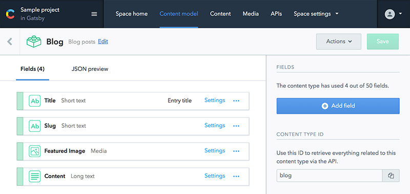
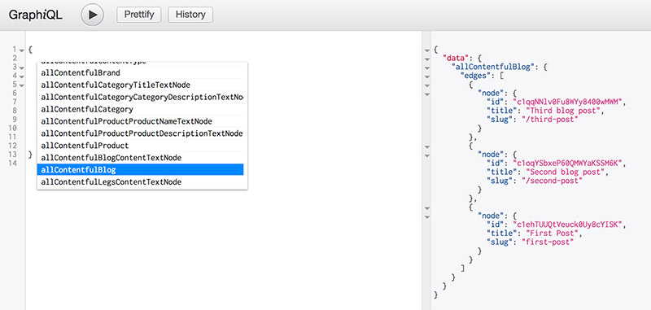

One of the most magical aspects of Gatsby.js is its ability to pull in data from a wide variety of sources. Leveraging the power of GraphQL, you can populate a Gatsby website with local markdown files, a CSV file, a MongoDB database, or from a list of popular content management systems (CMS). This means that if you have a Wordpress site, you can use Gatsby to pull in your posts and pages, and create a modern static website with a React front-end.

Gatsby also supports Contentful, which is a cloud hosted, headless CMS. The "headless" part means that there is no front-end layer, only a back-end which you can log into (think /wp-admin but a lot simpler). This is a perfect fit for us because we can use Gatsby as the front-end layer and Contentful as the back-end to manage pages and blog posts.

<h4 class="mt-4 mb-4"><a href="https://determined-cray-70c763.netlify.com/">Contentful and Gatsby.js Blog Demo</a> <small>( <a href="https://github.com/ChangoMan/gatsby-contentful-demo">view source</a> )</small></h4>

Start by installing the [gatsby-starter-default](https://github.com/gatsbyjs/gatsby-starter-default) official starter.

```bash
gatsby new gatsby-contentful https://github.com/gatsbyjs/gatsby-starter-default
cd gatsby-contentful
```

Now this starter is pretty bare bones, we're going to need a few additional plugins to make our site work.

```bash
yarn add gatsby-source-contentful gatsby-transformer-remark gatsby-image
```

The plugin `gatsby-source-contentful` is what allows us to connect with Contentful's API and get our data. The other two plugins will help us format that data into something useful for our site.

Let's add some configuration to our `gatsby-config.js`, which is located in the root folder.

```javascript
module.exports = {
    siteMetadata: {
        title: 'Gatsby Default Starter',
    },
    plugins: [
        {
            resolve: `gatsby-source-contentful`,
            options: {
                spaceId: `###`,
                accessToken: `###`,
            },
        },
        'gatsby-plugin-react-helmet',
        'gatsby-transformer-remark'
    ],
};
```

Here we are activating the Contentful plugin, but we need to create a new account with Contentful in order to get the `spaceId` and `accessToken`. Good thing they offer a very reasonable free tier, let's sign up! Head on over to [Contentful.com](https://www.contentful.com/).

<h3 class="mt-5 mb-3">Setting up Contentful</h3>

If you are new to Contentful, they have a [beginner's guide](https://www.contentful.com/r/knowledgebase/contentful-101/) to run you through the basics. For me personally, I come from a Wordpress background and Contentful reminded me a lot of [Advanced Custom Fields](https://www.advancedcustomfields.com/). You can create a content model and populate it with whatever fields you like. Once you sign up, there should be a Sample Project created for you to experiment with. Let's add a new content model so we're all on the same page.



For this demo, the "Blog" model I created has 4 fields. Title, slug, featured image, and content. The content field is long text and I used the default markdown appearance. The model name, "Blog", is also important because it will be used later in our GraphQL query.

While still in Contentful, head to the APIs page and create a new API key. Here is where we can grab our `spaceId` and `accessToken` for our `gatsby-config.js`. We can now also create some sample blog posts, go to the Content page and add them under the newly created Blog content type.

<h3 class="mt-5 mb-3">Querying for Contentful with GraphQL</h3>

After you add in your `spaceId` and `accessToken`, we can start up our Gatsby development process by going into the terminal and running `gatsby develop`. Go to `http://localhost:8000/` to see your site. If we now head to `http://localhost:8000/___graphql` we can see what's known as GraphiQL, which is a graphical interface for experimenting with GraphQL queries.

Let's try and get our new blog post data from GraphiQL. On the left panel enter the following query and hit the play button.

```javascript
{
  allContentfulBlog {
    edges {
      node {
        id
        title
        slug
      }
    }
  }
}
```
In the right panel, you should see the blog posts that you made in Contentful! GraphiQL also has some cool auto complete features, which will show you all the options available for a particular set of data. If you add a new line right above `allContentfulBlog` and hit `control + spacebar`, you should get a dropdown with all the other fields you can query.



Notice that the `allContentful` fields all have the content model's name after it, such as `allContentfulBrand` or `allContentfulProduct`. This is where the Contentful model name comes into play. Since we want our blog posts, the one we want to use is `allContentfulBlog` to match our "Blog" content model.

Open up `src/pages/index.js` in a text editor, this is our homepage component. Replace the code with the [demo site's index.js code](https://github.com/ChangoMan/gatsby-contentful-demo/blob/master/src/pages/index.js). Notice the GraphQL query at the bottom of the page, which looks very similar to our experiments in GraphiQL.

```javascript
export const pageQuery = graphql`
    query pageQuery {
        allContentfulBlog(
            filter: {
                node_locale: {eq: "en-US"}
            },
            sort: {
                fields: [createdAt], order: DESC
            }
        ) {
            edges {
                node {
                    id
                    title
                    slug
                    createdAt(formatString: "MMMM DD, YYYY")
                    featuredImage {
                        resolutions(width: 300) {
                            ...GatsbyContentfulResolutions
                        }
                    }
                    content {
                        childMarkdownRemark {
                            excerpt
                        }
                    }
                }
            }
        }
    }
`
```

There's some extra filters and sorting applied to the data, and we are getting fields such as the title, slug, featured image, and content. If you look at the `featuredImage`, we are getting the resolutions to be used with `gatsby-image`. For the `content`, the query comes in as markdown and we need to use `gatsby-transformer-remark` to convert it. After saving this page, you should see a list of Contentful blog posts on the homepage!

The last step is to have Gatsby generate the actual pages for each post. In the root folder, open up the `gatsby-node.js` file and replace with the following:

```javascript
const path = require('path')

exports.createPages = ({graphql, boundActionCreators}) => {
    const {createPage} = boundActionCreators
    return new Promise((resolve, reject) => {
        const blogPostTemplate = path.resolve('src/templates/blog-post.js')
        resolve(
            graphql(`
                {
                    allContentfulBlog (limit:100) {
                        edges {
                            node {
                                id
                                slug
                            }
                        }
                    }
                }
            `).then((result) => {
                if (result.errors) {
                    reject(result.errors)
                }
                result.data.allContentfulBlog.edges.forEach((edge) => {
                    createPage ({
                        path: edge.node.slug,
                        component: blogPostTemplate,
                        context: {
                            slug: edge.node.slug
                        }
                    })
                })
                return
            })
        )
    })
}
```
This uses the Gatsby API to automatically create pages that are queried with GraphQL. We use a `blogPostTemplate` in this file that doesn't exist yet, so create a new folder and file at `src/templates/blog-post.js` with the following code:

```jsx
import React, { Component } from 'react'
import PropTypes from 'prop-types'
import Img from "gatsby-image"

class BlogPost extends Component {
    render() {
        console.log(this.props)
        const { title, createdAt, featuredImage, content } = this.props.data.contentfulBlog
        return (
            <div>
                <h1 style={{
                    borderBottom: '1px solid #ccc',
                    paddingBottom: '0.5rem'
                }}>
                    {title}
                </h1>
                <p>{createdAt}</p>
                <div>
                    
                </div>
                <hr />
                <div dangerouslySetInnerHTML={{__html:content.childMarkdownRemark.html}} />
            </div>
        )
    }
}

BlogPost.PropTypes = {
    data: PropTypes.object.isRequired
}

export default BlogPost

export const pageQuery = graphql`
    query blogPostQuery($slug: String!){
        contentfulBlog(slug: {eq: $slug}) {
            title
            createdAt(formatString: "MMMM DD, YYYY")
            featuredImage {
                sizes(maxWidth: 800) {
                    ...GatsbyContentfulSizes
                }
            }
            content {
                childMarkdownRemark {
                    html
                }
            }
        }
    }
`
```
The query used on this page is similar to the one from the homepage, we just display the data in a different way. You'll probably need to stop and restart the `gatsby develop` command in the terminal, this will rebuild the site with the new blog pages. Feel free to add more blog posts in Contentful, but right now you'll need to rebuild the site each time a new post is created to pull in that data.